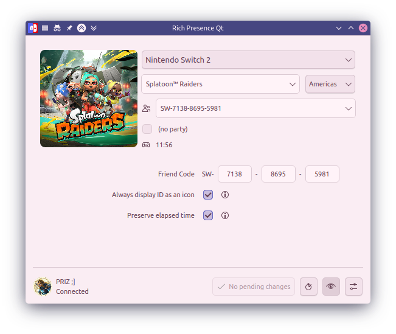

# Overview

A simple application that allows you to create your own activity statuses for all gamers and display them on your Discord profile.

## Features

- Integrates with IGDB
  - Most consoles and games are listed here
- Search directly from the eShop
  - No manual mirrors with missing titles
  - Only for Nintendo Switch and Switch 2
- Buy from eShop button
- Simple, intuitive Qt UI (no Godot)
- Simplified install (compared to NinStar's repo)
  - Auto-install on Linux!
- Various customization options:
  - Short game descriptions
  - Nintendo Friend Code sharing.
  - Elapsed time, time remaining, party size, and more.

> [!WARNING]
> Automatic game detection is not supported on any console. Previous efforts
> to integrate with online services like NSO have been quashed several years ago,
> and any efforts to do so now will likely result in your online account being
> terminated.
>
> This only refers to the console's online services, not Discord. Discord actually
> encourages programs like this so they can build their game database.

You can support NinStar's work by purchasing this application:

    

# Install

| OS      | Linked                                     | Portable                                                  |
| ------- | ------------------------------------------ | --------------------------------------------------------- |
| Linux   | [rich-presence-qt_linux][linux_shared]     | [rich-presence-qt_linux_(portable)][linux_portable]       |
| Windows | [rich-presence-qt_windows.exe][win_shared] | [rich-presence-qt_windows_(portable).zip][win_portable]   |
| macOS   | [rich-presence-qt_macOS.app][mac_shared]   | [rich-presence-qt_macOS_(portable).app.zip][mac_portable] |

> [!WARNING]
>
> 1. Builds for macOS and Windows are completely untested.
> 2. For Linked builds, ensure that you have [Qt][qt] installed, and the Breeze Icon Pack to be safe.

    
Build manually

1. `git clone https://github.com/voxelprismatic/Rich-Presence-U.git`
2. Download [Golang][golang] and [Qt][qt]
3. Open a terminal or command prompt
4. Navigate to the folder with the code
   - You'll see `main.go`
5. Run `go build -o app main.go`
   - This will take lots of time
6. Double-click the binary called `app`

# Credits

- **Original Codebase/Idea** - NinStar
- **Rewrite** - VoxelPrismatic
- **Databases**
  - Twitch/IGDB
  - Nintendo eShop

# Third-party code

- [**discord-rpc**](https://github.com/discord/discord-rpc) - Discord

[qt]: https://www.qt.io/development/download-qt-installer
[database]: https://github.com/ninstar/Rich-Presence-U-DB
[zip]: https://github.com/voxelprismatic/Rich-Presence-U/archive/refs/heads/main.zip
[godot]: https://godotengine.org/download/archive/3.6.2-stable/
[templates]: https://github.com/godotengine/godot/releases/download/3.6.2-stable/Godot_v3.6.2-stable_export_templates.tpz
[compile]: https://docs.godotengine.org/en/3.6/development/compiling
[locales]: https://github.com/ninstar/Rich-Presence-U/tree/main/source/locales
[locale_template]: https://github.com/ninstar/Rich-Presence-U/tree/main/source/locales/english.csv
[rcedit]: https://github.com/electron/rcedit/releases/download/v2.0.0/rcedit-x64.exe
[golang]: https://go.dev/
[linux_shared]: https://github.com/VoxelPrismatic/Rich-Presence-U/releases/latest/download/rich-presence-qt_linux
[linux_portable]: https://github.com/VoxelPrismatic/Rich-Presence-U/releases/latest/download/rich-presence-qt_linux_(portable)
[win_shared]: https://github.com/VoxelPrismatic/Rich-Presence-U/releases/latest/download/rich-presence-qt_windows.exe
[win_portable]: https://github.com/VoxelPrismatic/Rich-Presence-U/releases/latest/download/rich-presence-qt_windows_(portable).zip
[mac_shared]: https://github.com/VoxelPrismatic/Rich-Presence-U/releases/latest/download/rich-presence-qt_macOS.app
[mac_portable]: https://github.com/VoxelPrismatic/Rich-Presence-U/releases/latest/download/rich-presence-qt_macOS_(portable).app.zip
